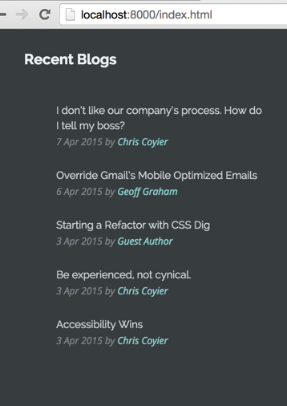

# ReactJS - List of Blog Posts

A [ReactJS](https://facebook.github.io/react/) component for displaying a list of blog posts.




### Usage

Specify the blog rss feed and the number of posts to display in the `blogPosts.js.jsx` file:

```javascript
React.render(
  <BlogPostsApp url='http://css-tricks.com/feed' numberOfPosts='5' />,
  document.getElementById('blogPosts')
);
```

Then in your HTML simply include a div 

```HTML
<div id="blogPosts"></div>
```

### License
Released under the MIT License.